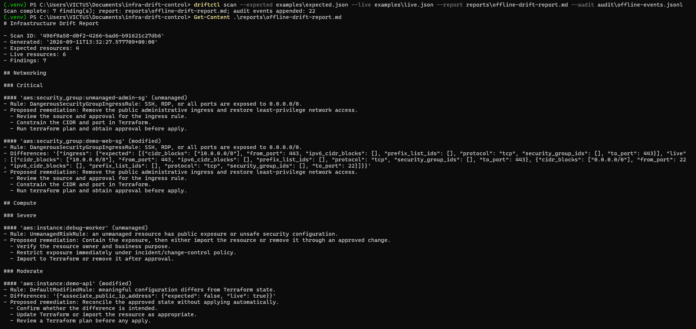
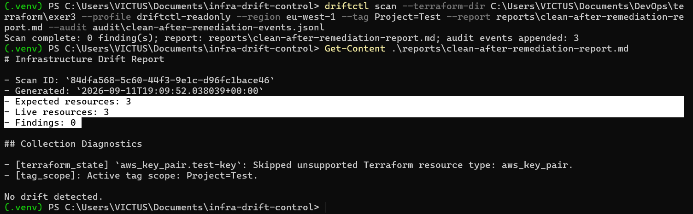

# Setup and Usage Guide

This guide shows you how to install and use Infrastructure Drift Control (DriftCTL). It begins with a safe example that does not use AWS, then explains how to scan a small non-production AWS environment.

DriftCTL is read-only. It reads Terraform state and AWS configuration, compares them, writes a report, and suggests what to check next. It does not run `terraform apply`, edit Terraform state, or make changes in AWS.

## What You Will Do

1. Download the project and install its Python packages.
2. Run automated checks to confirm the tool works on your computer.
3. Run a safe example scan using files included in this repository.
4. Set up read-only AWS access and scan a Terraform-managed test environment.
5. Optionally make small, temporary changes to see how DriftCTL reports real drift.

## Before You Start

Install these tools before beginning:

- **Git**: downloads the project from GitHub.
- **Python 3.11 or later**: runs DriftCTL.
- **Terraform**: needed only when scanning real Terraform state.
- **AWS CLI**: needed only when scanning a real AWS environment.
- **An AWS account or sandbox environment**: needed only for a live scan. Use a personal, learning, or non-production environment. Do not start with production infrastructure.

Check which tools are already installed in PowerShell:

```powershell
git --version
```

```powershell
python --version
```

```powershell
terraform --version
```

```powershell
aws --version
```

You can complete the safe local example even if Terraform or the AWS CLI is not installed yet. You need them only for the live AWS sections later in this guide.

## 1. Clone the Repository

Open PowerShell in the folder where you keep development projects. Run this command, replacing `<repository-url>` with the HTTPS or SSH address shown under GitHub's **Code** button:

```powershell
git clone <repository-url>
```

Move into the new project folder:

```powershell
cd infra-drift-control
```

Unless a step says otherwise, run the remaining commands from this folder.

## 2. Create a Python Environment

A Python virtual environment is a small, isolated folder that holds this project's Python packages. It prevents this project from changing packages used by your other work.

Run these commands one at a time from the `infra-drift-control` folder.

First, check the Python version that will be used:

```powershell
python --version
```

Create the virtual environment. This creates a `.venv` folder inside the project:

```powershell
python -m venv .venv
```

Windows may block PowerShell scripts by default. The next command allows the local activation script to run in this PowerShell window only. It does not permanently change your computer's security settings:

```powershell
Set-ExecutionPolicy -Scope Process -ExecutionPolicy Bypass
```

Activate the environment:

```powershell
.\.venv\Scripts\Activate.ps1
```

When activation works, your PowerShell prompt starts with `(.venv)`. Keep this window open while using DriftCTL.

Update `pip`, the Python package installer:

```powershell
python -m pip install --upgrade pip
```

Install DriftCTL and the development packages used by its tests:

```powershell
python -m pip install -e ".[dev]"
```

The `-e` option means “editable.” It lets your local copy use changes in the `src/` folder immediately, without reinstalling the package after every code change.


## 3. Run the Test Suite

Before scanning any infrastructure, run the automated tests. The tests use prepared AWS-like responses. They do not sign in to AWS and they do not change anything.

```powershell
pytest -q
```

The `-q` option makes the result shorter and easier to read. Do not continue to a live scan if the tests fail. Read the failure first and fix it before relying on the tool.


## 4. Run the Safe Offline Demonstration

The repository includes two sample files:

- `examples/expected.json`: a sample of the state Terraform records after it applies infrastructure.
- `examples/live.json`: a sample of the information AWS returns when DriftCTL reads live resources.

The command below compares those two local files. It does not contact AWS and does not need credentials:

```powershell
driftctl scan --expected examples\expected.json --live examples\live.json --report reports\offline-drift-report.md --audit audit\offline-events.jsonl
```

After the scan, DriftCTL creates two files:

- `reports/offline-drift-report.md`: a report grouped by resource type and severity.
- `audit/offline-events.jsonl`: an append-only audit log. Each line is a JSON event created during the scan.

These files are excluded from Git. A live report can contain details about your infrastructure, so it should not be published by accident.

Display the report in PowerShell:

```powershell
Get-Content .\reports\offline-drift-report.md
```

Every finding has one of these three drift types:

- `missing`: Terraform expects a resource, but AWS no longer has it.
- `unmanaged`: AWS has a resource that Terraform is not managing.
- `modified`: Terraform and AWS both have the resource, but one or more settings are different.



## 5. Prepare a Safe Live AWS Demonstration

Complete this section only after the offline example and tests work.

Use a dedicated AWS sandbox account when possible. If you use one personal account, create a clearly named development environment with small resources that you can safely remove later. Do not point your first live scan at production infrastructure.

### Create Test Infrastructure

Create a separate Terraform project for the AWS resources you want to scan. Start small: one EC2 instance and one security group are enough. Keep this Terraform project outside the DriftCTL repository because it is the environment being inspected, while DriftCTL is the reusable tool doing the inspection.

Add the same tag to every resource you want DriftCTL to scan. For example:

```hcl
tags = {
  Project = "Test"
}
```

In the Terraform project folder, run these commands one at a time:

```powershell
terraform init
```

`terraform init` downloads the provider plugins Terraform needs.

```powershell
terraform plan
```

`terraform plan` shows what Terraform intends to create or change. Read the plan carefully.

```powershell
terraform apply
```

Run `terraform apply` only after you understand and approve the plan. Terraform state then records the infrastructure Terraform created. DriftCTL later compares that state with what AWS reports now.

### Configure Read-Only AWS Access

DriftCTL needs permission to look at AWS resources, but it does not need permission to create, update, or delete them. Use the least-privilege policy at `infra/iam/driftctl-read-only-policy.json` to create a dedicated read-only IAM user or role.

Configure its credentials as a local AWS CLI profile. The AWS CLI asks for the credentials privately in the terminal:

```powershell
aws configure --profile driftctl-readonly
```

Check that the profile works and see which AWS identity it uses:

```powershell
aws sts get-caller-identity --profile driftctl-readonly
```

The first command stores credentials on your computer. Never add access keys, secret access keys, session tokens, passwords, or other credentials to this repository, an `.env` file, a screenshot, or a chat message. If you take a screenshot of this step, cover the full access-key and secret-key values before saving it.


### Run a Live Scan With the Full Command

The command below is the clearest way to see every value DriftCTL needs. Replace the Terraform path, AWS profile, region, and tag with values for your own test environment:

```powershell
driftctl scan --terraform-dir C:\path\to\your\terraform-project --profile driftctl-readonly --region eu-west-1 --tag Project=Test --report reports\aws-drift-report.md --audit audit\events.jsonl
```

DriftCTL uses `terraform show -json` to read the applied Terraform state. It does not run `terraform init`, `terraform plan`, `terraform apply`, or `terraform refresh`.

Your first live scan is your **baseline scan**. Right after Terraform applies your infrastructure, the report should normally show no unexpected drift. If it shows a collection diagnostic, read the message before continuing. A collection problem is not the same as a clean scan.

### Optional: Save the Scan Settings in a Configuration File

The full command above shows every setting DriftCTL needs. Typing it every time can become tiring. If you scan the same Terraform environment regularly, store those settings in one small local file named `driftctl.toml`.

Put `driftctl.toml` in the top folder of the Terraform project it describes. This is the best place because the file belongs to that one environment, not to the DriftCTL source code. It does not contain credentials. It stores only the Terraform folder, the name of your AWS CLI profile, the AWS region, the tag used to limit the scan, and the report and audit locations.

Create a file named `driftctl.toml` beside your Terraform `.tf` files. Start with this example and replace the profile, region, and tag where needed:

```toml
[scan]
terraform_dir = "."
aws_profile = "driftctl-readonly"
region = "eu-west-1"
tags = ["Project=Test"]
report = "driftctl-output/live-report.md"
audit = "driftctl-output/events.jsonl"
```

`terraform_dir = "."` means “use the folder that contains this configuration file.” The report and audit paths also start from that same folder. This keeps the scan output next to the infrastructure it describes.

Do not put AWS access keys, secret access keys, session tokens, passwords, or other credentials in `driftctl.toml`. The tool rejects configuration keys that look like secrets.

After activating the DriftCTL virtual environment, move into the Terraform project:

```powershell
cd C:\path\to\your\terraform-project
```

Then run the short command:

```powershell
driftctl scan
```

DriftCTL finds `driftctl.toml` in the current folder and uses the settings inside it.

You can also run the scan from another folder by giving the full path to the configuration file:

```powershell
driftctl scan --config C:\path\to\your\terraform-project\driftctl.toml
```

The paths inside `driftctl.toml` are based on the location of that file, not the folder currently open in PowerShell. You can still add command options when needed. For example, a `--report` value on the command line replaces the report path saved in the configuration file for that one scan.

### Limit a Live Scan to One Environment Tag

AWS accounts often contain resources from several projects or environments. The `--tag KEY=VALUE` option tells DriftCTL to look only at resources with a matching tag. You can use more than one `--tag` option when a resource must match several tags.

DriftCTL applies the tag filter to both Terraform state and live AWS resources. This means resources outside the chosen environment do not create `missing`, `unmanaged`, or `modified` findings. The report records the active tag scope so you can see exactly what was scanned later.

Every resource you want to include must have the chosen tag. For example, add `Project = "Test"` to the Terraform tags for your EC2 instance and security group. Then run `terraform plan`, review the result, and use `terraform apply` to add the tag in AWS.

If you use the full command, run a scoped baseline like this:

```powershell
driftctl scan --terraform-dir C:\path\to\your\terraform-project --profile driftctl-readonly --region eu-west-1 --tag Project=Test --report reports\live-baseline-report.md --audit audit\live-baseline-events.jsonl
```

If the same values are already in `driftctl.toml`, simply run:

```powershell
driftctl scan
```

To read the report from the configuration example, run:

```powershell
Get-Content .\driftctl-output\live-report.md
```

A clean baseline shows matching expected and live resource counts, `0` findings, and `No drift detected`.


## 6. Run Controlled Live Drift Validation

This optional section proves that DriftCTL can detect real differences between Terraform state and AWS. You will make small, temporary changes in a non-production environment, run a scan, and then remove each change.

DriftCTL stays read-only during every test. The temporary changes below are made manually in the AWS Console so that the tool has drift to find.

Use the same Terraform directory, AWS profile, region, and tag scope as the baseline scan. The examples use `Project=Test`. Replace the placeholder path with your own Terraform project path.

### Test 1: Find a Small Tag Change

This test checks that a tag-only change on a Terraform-managed EC2 instance is reported as `modified` drift with `minor` severity.

In the AWS Console, open **EC2**, then **Instances**. Select a Terraform-managed test instance that has `Project=Test`. In the **Tags** tab, add this temporary tag:

```text
Owner=Demo
```

Do not remove the `Project=Test` tag. DriftCTL needs it to include the instance in the scan.

If you are using the full command, run:

```powershell
driftctl scan --terraform-dir C:\path\to\your\terraform-project --profile driftctl-readonly --region eu-west-1 --tag Project=Test --report reports\minor-tag-drift-report.md --audit audit\minor-tag-drift-events.jsonl
```

If you are using `driftctl.toml`, run this shorter version from the Terraform project folder. The two output options give this test its own report and audit log:

```powershell
driftctl scan --report driftctl-output\minor-tag-drift-report.md --audit driftctl-output\minor-tag-drift-events.jsonl
```

Display the report:

```powershell
Get-Content .\driftctl-output\minor-tag-drift-report.md
```

The report should show a `Compute` finding with `modified` drift and `minor` severity. Remove the temporary `Owner=Demo` tag in the AWS Console before moving to the next test.


### Test 2: Find a Resource Terraform Does Not Manage

This test checks that DriftCTL finds a resource created in AWS that is not listed in Terraform state.

In the AWS Console, create an **unattached security group** in the same VPC as your test infrastructure. Give it a clear temporary name, add the tag `Project=Test`, and do not add inbound rules. An unattached security group with no inbound rules does not expose an instance and does not create EC2 running cost.

If you are using the full command, run:

```powershell
driftctl scan --terraform-dir C:\path\to\your\terraform-project --profile driftctl-readonly --region eu-west-1 --tag Project=Test --report reports\unmanaged-resource-report.md --audit audit\unmanaged-resource-events.jsonl
```

If you are using `driftctl.toml`, run:

```powershell
driftctl scan --report driftctl-output\unmanaged-resource-report.md --audit driftctl-output\unmanaged-resource-events.jsonl
```

Display the report:

```powershell
Get-Content .\driftctl-output\unmanaged-resource-report.md
```

The report should show a `Networking` finding with `unmanaged` drift. Delete the temporary security group in the AWS Console before moving to the next test.


### Test 3: Find Unsafe Public SSH Access

This test checks that DriftCTL treats public SSH access as a `critical` risk. The test uses a detached security group, so it does not expose a running EC2 instance.

Before this test, create and apply a separate **Terraform-managed, unattached** security group with the scan tag and no inbound rules. It must already exist in Terraform state before you edit it manually. Do not use a security group attached to an EC2 instance. First run a baseline scan and make sure it returns `0` findings.

In the AWS Console, open the detached test security group's **Inbound rules**. Add a temporary rule with these values:

- Type: `SSH`
- Port: `22`
- Source: `Anywhere-IPv4` (`0.0.0.0/0`)

Save the rule, run the scan immediately, capture the result, and then remove the rule immediately.

If you are using the full command, run:

```powershell
driftctl scan --terraform-dir C:\path\to\your\terraform-project --profile driftctl-readonly --region eu-west-1 --tag Project=Test --report reports\critical-security-drift-report.md --audit audit\critical-security-drift-events.jsonl
```

If you are using `driftctl.toml`, run:

```powershell
driftctl scan --report driftctl-output\critical-security-drift-report.md --audit driftctl-output\critical-security-drift-events.jsonl
```

Display the report:

```powershell
Get-Content .\driftctl-output\critical-security-drift-report.md
```

The report should show a `Networking` finding with `modified` drift and `critical` severity. It should say that public SSH exposure caused the risk level. Remove the temporary SSH rule in the AWS Console immediately after checking the result.


### Test 4: Confirm the Environment Is Clean Again

After removing every temporary change, run another baseline scan. This confirms that AWS matches Terraform state again.

If you are using the full command, run:

```powershell
driftctl scan --terraform-dir C:\path\to\your\terraform-project --profile driftctl-readonly --region eu-west-1 --tag Project=Test --report reports\clean-after-remediation-report.md --audit audit\clean-after-remediation-events.jsonl
```

If you are using `driftctl.toml`, run:

```powershell
driftctl scan --report driftctl-output\clean-after-remediation-report.md --audit driftctl-output\clean-after-remediation-events.jsonl
```

Display the final report:

```powershell
Get-Content .\driftctl-output\clean-after-remediation-report.md
```

A clean result shows matching expected and live resource counts, `0` findings, and `No drift detected`. You can keep the detached Terraform-managed test security group as a reusable test fixture if it stays unattached and has no inbound rules.



## Troubleshooting

| Issue | Solution |
| --- | --- |
| `driftctl` is not recognized | Activate the virtual environment with `.venv\Scripts\Activate.ps1`. Then run `python -m pip install -e ".[dev]"` from the DriftCTL repository. |
| AWS credentials cannot be found | Check that the AWS CLI profile exists with `aws sts get-caller-identity --profile driftctl-readonly`. Use the same profile name in the command or in `driftctl.toml`. |
| Terraform state cannot be read | Point DriftCTL at the Terraform working directory that owns the applied state. In that directory, run `terraform show -json` to make sure Terraform can read the state. Do not commit this output because it can contain details about your infrastructure. |
| `driftctl scan` says it needs a Terraform directory, region, report, or audit path | Make sure `driftctl.toml` is in the current Terraform project folder and includes all required `[scan]` values. You can also use the full command and provide the missing option directly. |
| A resource is missing from a scoped scan | Check that the resource has every tag listed in your `--tag` options or in the `tags` setting of `driftctl.toml`. Then run `terraform plan` and `terraform apply` if Terraform still needs to add the tag. |
