# Manual Setup and Usage Guide

This guide shows you how to install and use Infrastructure Drift Control (DriftCTL) manually from a terminal. It begins with a safe example that does not use AWS, then explains how to scan a small non-production AWS environment. Windows PowerShell commands appear first; Bash and Zsh equivalents are included where shell syntax differs on Linux and macOS.

DriftCTL is read-only. It reads Terraform state and AWS configuration, compares them, writes a report, and suggests what to check next. It does not run `terraform apply`, edit Terraform state, or make changes in AWS.

> [!NOTE]
> This guide covers manual scans. It does not configure Jenkins, GitHub Actions, or another automation platform.

## What You Will Do

1. Download the project and install its Python packages.
2. Run automated checks to confirm the tool works on your computer.
3. Run a safe example scan using files included in this repository.
4. Set up read-only AWS access and scan a Terraform-managed test environment.
5. Check application-facing infrastructure such as NAT gateways, Application Load Balancers, and RDS DB instances.
6. Make controlled, temporary changes to see how DriftCTL reports different kinds of real drift.

## Before You Start

Install these tools before beginning:

- **Git**: downloads the project from GitHub.
- **Python 3.11 or later**: runs DriftCTL.
- **Terraform**: needed only when scanning real Terraform state.
- **AWS CLI**: needed only when scanning a real AWS environment.
- **An AWS account or sandbox environment**: needed only for a live scan. Use a personal, learning, or non-production environment. Do not start with production infrastructure.

Check which tools are already installed in your terminal. The following commands work in PowerShell, Bash, and Zsh:

```powershell
git --version
```

```powershell
python --version
```

```powershell
terraform --version
```

```powershell
aws --version
```

You can complete the safe local example even if Terraform or the AWS CLI is not installed yet. You need them only for the live AWS sections later in this guide.

## 1. Clone the Repository

Open a terminal in the folder where you keep development projects. Run this command, replacing `<repository-url>` with the HTTPS or SSH address shown under GitHub's **Code** button:

```powershell
git clone <repository-url>
```

Move into the new project folder:

```powershell
cd infra-drift-control
```

Unless a step says otherwise, run the remaining commands from the `infra-drift-control` project folder that you just opened with `cd infra-drift-control`.

## 2. Create a Python Environment

A Python virtual environment is a small, isolated folder that holds this project's Python packages. It prevents this project from changing packages used by your other work.

Run these commands one at a time from the `infra-drift-control` folder.

First, check the Python version that will be used:

```powershell
python --version
```

Create the virtual environment. This creates a `.venv` folder inside the project:

```powershell
python -m venv .venv
```

In Windows PowerShell, Windows may block local activation scripts by default. The next command allows the local activation script to run in this PowerShell window only. It does not permanently change your computer's security settings:

```powershell
Set-ExecutionPolicy -Scope Process -ExecutionPolicy Bypass
```

Activate the environment in Windows PowerShell:

```powershell
.\.venv\Scripts\Activate.ps1
```

In Bash or Zsh on Linux or macOS, activate the same environment with:

```bash
source .venv/bin/activate
```

When activation works, your terminal prompt starts with `(.venv)`. Keep this terminal open while using DriftCTL.

Update `pip`, the Python package installer:

```powershell
python -m pip install --upgrade pip
```

Install DriftCTL and the development packages used by its tests:

```powershell
python -m pip install -e ".[dev]"
```

The `-e` option means “editable.” It lets your local copy use changes in the `src/` folder immediately, without reinstalling the package after every code change.

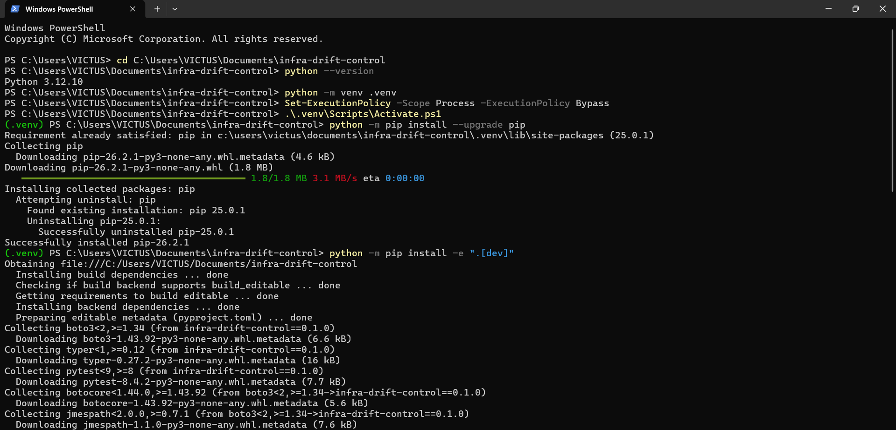

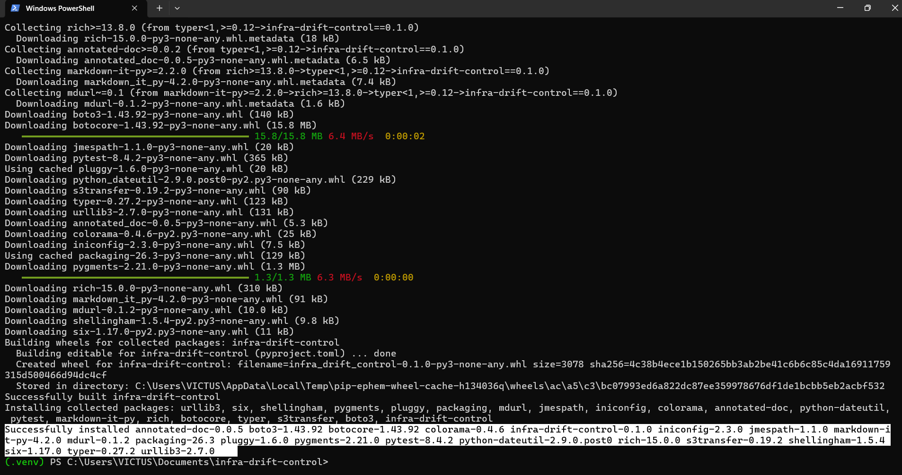

## 3. Run the Test Suite

Before scanning any infrastructure, run the automated tests. The tests use prepared AWS-like responses. They do not sign in to AWS and they do not change anything.

```powershell
pytest -q
```

The `-q` option makes the result shorter and easier to read. Do not continue to a live scan if the tests fail. Read the failure first and fix it before relying on the tool.

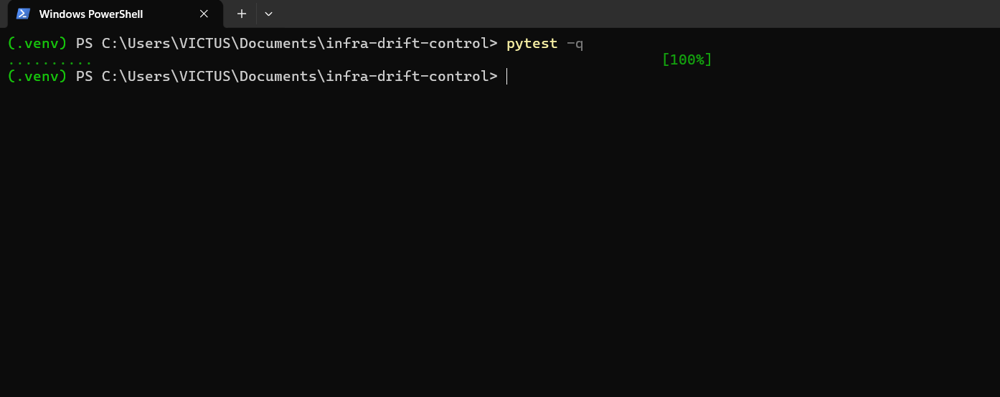

## 4. Run the Safe Offline Demonstration

When you clone this repository, it already includes two complete sample inventory files. You do not need to create AWS resources, create Terraform files, or configure AWS credentials for this offline demonstration:

- `examples/expected.json`: a sample of the state Terraform records after it applies infrastructure.
- `examples/live.json`: a sample of the information AWS returns when DriftCTL reads live resources.

The command below compares those two local files. It does not contact AWS and does not need credentials:

```powershell
driftctl scan --expected examples\expected.json --live examples\live.json --report reports\offline-drift-report.md --audit audit\offline-events.jsonl
```

After the scan, DriftCTL creates two files:

- `reports/offline-drift-report.md`: a report grouped by resource type and severity.
- `audit/offline-events.jsonl`: an append-only audit log. Each line is a JSON event created during the scan.

> [!NOTE]
> The files created by this offline example contain only the repository's sample data. A report from a real scan can contain details about your own infrastructure, so review it carefully before sharing it.

Display the report in PowerShell:

```powershell
Get-Content .\reports\offline-drift-report.md
```

This example is designed to produce findings. The critical, severe, and moderate results are deliberate sample data, not resources in your AWS account. It is a safe way to learn how DriftCTL presents different risk levels before scanning real infrastructure.

Every finding has one of these three drift types:

- `missing`: Terraform expects a resource, but AWS no longer has it.
- `unmanaged`: AWS has a resource that Terraform is not managing.
- `modified`: Terraform and AWS both have the resource, but one or more settings are different.

The full offline demonstration has seven findings, so its evidence is split into three readable screenshots:

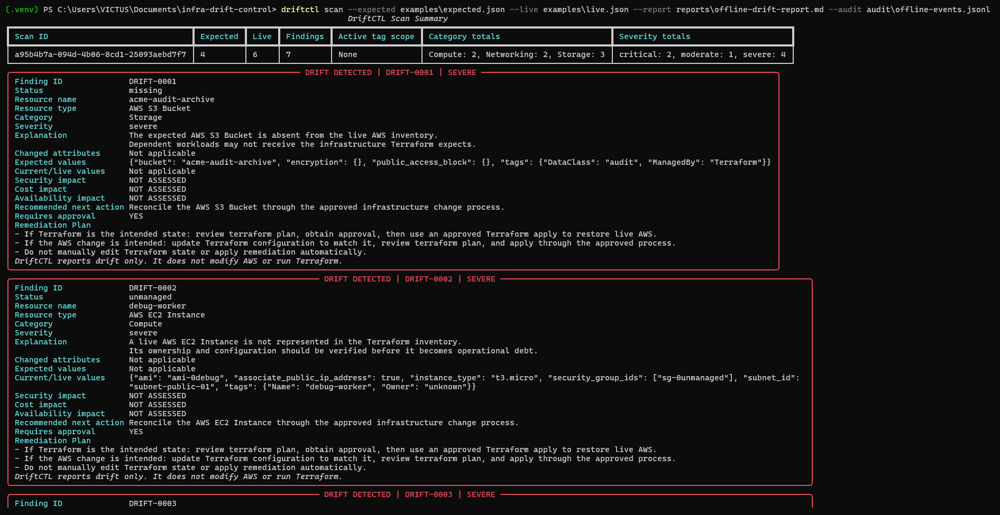

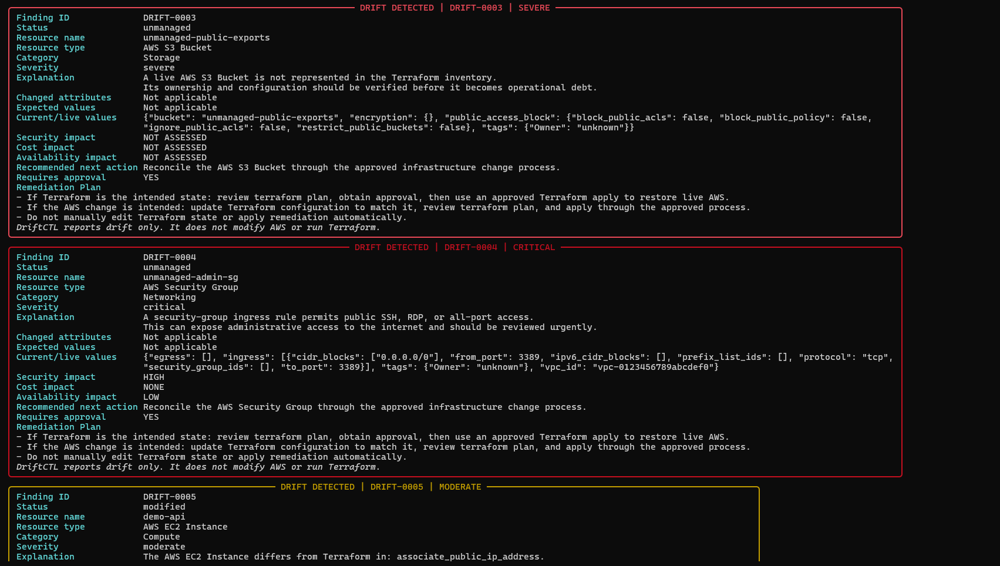

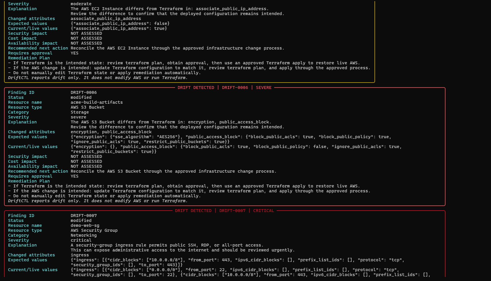

## 5. Prepare a Safe Live AWS Demonstration

Complete this section only after the offline example and tests work when you are evaluating DriftCTL for the first time.

This section supports two paths:

- **First-time evaluation:** If you are trying out the tool to test its effectiveness, create a small, disposable non-production environment with the supplied Terraform reference below, then use it to confirm that DriftCTL works with your AWS account.
- **Existing production environment:** To directly run a manual scan on your live, production infrastructure and resources, then do not create test infrastructure. Start at [Configure Read-Only AWS Access](#configure-read-only-aws-access), then use [Run a Live Scan With the Full Command](#run-a-live-scan-with-the-full-command), save a local configuration if needed, and limit the scan to the intended environment tag of your infra.

Use a dedicated AWS sandbox account when possible. If you use one personal account, create a clearly named development environment with small resources that you can safely remove later. Do not point your first live scan at production infrastructure.

### Create Test Infrastructure for a First-Time Evaluation

Use this subsection only for a first-time evaluation. For an existing production environment, Terraform has already applied the infrastructure you want to inspect, so skip this subsection. Use a separate Terraform working directory for evaluation resources. DriftCTL includes a sanitized [live-validation Terraform reference](../infra/terraform/live-validation/README.md) that documents the non-production environment used for this project's controlled tests. You can use that folder as a starting point (`infra/terraform/live-validation/`), or create infrastructure that matches your own learning or non-production needs. A smaller generic example is also available at `infra/terraform/example-infrastructure/`. Terraform source can be version controlled with DriftCTL; Terraform state, local variables, plans, credentials, and generated scan output must remain local.

The committed live-validation reference contains the retained VPC, public and private subnets, internet gateway, route tables, private network ACL, IAM role and instance profile, optional EC2 fixture, private Route 53 hosted zone, A record, and an opt-in ECS Fargate configuration used by this project. Earlier controlled validation also created a NAT gateway, Application Load Balancer with target group and listener, and an RDS DB instance. Those chargeable resources were temporary and have been destroyed, so they are not created by the current reference configuration. Start with only the services that make sense for your own learning or non-production environment.

> [!NOTE]
> NAT gateways, load balancers, and databases can incur charges while they exist. Create them only in a short-lived test environment, watch the AWS billing console, and remove them when your validation is complete unless you deliberately choose to retain them.

> [!NOTE]
> ECS Fargate tasks and CloudWatch Logs can also incur charges while they exist. The ECS validation configuration is opt-in and is intended only for a short-lived, non-production test. The Fargate task receives a public IP solely so this small lab can retrieve its public container image without a NAT gateway; its security group has no inbound rules. This is a validation design, not a production networking recommendation.

Add the same tag to every resource you want DriftCTL to scan. For example:

```hcl
tags = {
  Project = "Test"
}
```

In the Terraform project folder, run these commands one at a time:

```powershell
terraform init
```

`terraform init` downloads the provider plugins Terraform needs.

```powershell
terraform plan
```

`terraform plan` shows what Terraform intends to create or change. Read the plan carefully.

```powershell
terraform apply
```

Run `terraform apply` only after you understand and approve the plan. Terraform state then records the infrastructure Terraform created. DriftCTL later compares that state with what AWS reports now.

### Configure Read-Only AWS Access

DriftCTL needs permission to look at AWS resources, but it does not need permission to create, update, or delete them. The repository includes a policy at `infra/iam/driftctl-read-only-policy.json`. This policy lists only the AWS read actions DriftCTL needs for its supported services.

This is the same access configuration used for an existing production environment: attach the policy to the approved scanning identity, then point DriftCTL at the matching applied Terraform project and AWS environment.

For a personal learning or sandbox account, the simplest option is to create a dedicated IAM user used only by DriftCTL. Do not use your AWS root user.

1. In the DriftCTL repository, open `infra/iam/driftctl-read-only-policy.json` and copy its full contents.
2. In the AWS Console, open **IAM**. Select **Policies**, then **Create policy**, then the **JSON** tab.
3. Replace the example policy with the copied contents. Continue to the review page, give the policy a clear name such as `InfrastructureDriftControlReadOnly`, and create it.
4. In IAM, select **Users** and create a user such as `driftctl-readonly`. This user is for AWS CLI access; it does not need permission to create or change infrastructure.
5. During the permissions step, attach the `InfrastructureDriftControlReadOnly` policy you just created.
6. Open the new user's **Security credentials** tab. Under **Access keys**, create an access key for **Command Line Interface (CLI)** use. AWS shows the secret access key only once.

If your organisation already uses an IAM role or AWS IAM Identity Center, attach the same policy to the approved role instead. This is normally the appropriate production approach. Configure the AWS CLI profile using your organisation's sign-in process. Do not create both an IAM user and a role for the same scan unless your organisation requires it.

After creating the access key, configure its credentials as a local AWS CLI profile. Run this command in PowerShell and enter the access key ID, secret access key, default region, and output format when prompted:

```powershell
aws configure --profile driftctl-readonly
```

Check that the profile works and see which AWS identity it uses:

```powershell
aws sts get-caller-identity --profile driftctl-readonly
```

The first command stores credentials on your computer.

> [!WARNING]
> Never add access keys, secret access keys, session tokens, passwords, or other credentials to your repository, an `.env` file, a screenshot, or a chat message. If you take a screenshot of this step for your use, cover the full access-key and secret-key values before saving it.

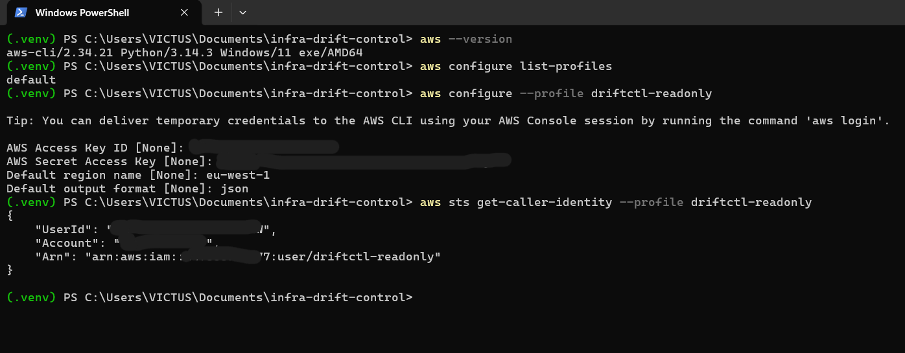

The following evidence shows a dedicated read-only profile successfully reading a NAT gateway, an Application Load Balancer, and an RDS DB instance. It demonstrates that the collection identity can inspect the additional services without being used to make changes.

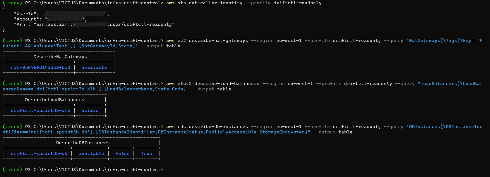

### Run a Live Scan With the Full Command

The command below is the clearest way to see every value DriftCTL needs. *It works for an evaluation environment and for an existing production environment.* Replace the Terraform path, AWS profile, region, and tag with values for the environment you intend to scan. For production, the Terraform path must be the applied project that manages that AWS environment, and the profile must use the approved read-only scanning identity.

```powershell
driftctl scan --terraform-dir C:\path\to\your\terraform-project --profile driftctl-readonly --region eu-west-1 --tag Project=Test --report reports\aws-drift-report.md --audit audit\events.jsonl
```

In Bash or Zsh, use forward slashes and a Unix-style Terraform path:

```bash
driftctl scan --terraform-dir /path/to/your/terraform-project --profile driftctl-readonly --region eu-west-1 --tag Project=Test --report reports/aws-drift-report.md --audit audit/events.jsonl
```

> [!NOTE]
> DriftCTL uses `terraform show -json` to read the applied Terraform state. It does not run `terraform init`, `terraform plan`, `terraform apply`, or `terraform refresh`.

Your first live scan is your **baseline scan**. Right after Terraform applies your infrastructure, the report should normally show no unexpected drift. If it shows a collection diagnostic, read the message before continuing. A collection problem is not the same as a clean scan.

Route 53 automatically creates two records at the root of every hosted zone: an **SOA** (Start of Authority) record and **NS** (Name Server) records. These are managed by Route 53, not normally declared in Terraform. DriftCTL recognises these provider-managed records and does not report them as unmanaged drift.

### Optional: Save the Scan Settings in a Configuration File

The full command above shows every setting DriftCTL needs. Typing it every time can become tiring. If you scan the same Terraform environment regularly, including a production environment, store those settings in one small local file named `driftctl.toml`.

Put `driftctl.toml` in the top folder of the Terraform project it describes. This is the best place because the file belongs to that one environment, not to the DriftCTL source code. It does not contain credentials. It stores only the Terraform folder, the name of your AWS CLI profile, the AWS region, the tag used to limit the scan, and the report and audit locations.

Create a file named `driftctl.toml` beside your Terraform `.tf` files. Start with this example and replace the profile, region, and tag where needed:

```toml
[scan]
terraform_dir = "."
aws_profile = "driftctl-readonly"
region = "eu-west-1"
tags = ["Project=Test"]
report = "driftctl-output/live-report.md"
audit = "driftctl-output/events.jsonl"
```

`terraform_dir = "."` means “use the folder that contains this configuration file.” The report and audit paths also start from that same folder. This keeps the scan output next to the infrastructure it describes.

> [!WARNING]
> Do not put AWS access keys, secret access keys, session tokens, passwords, or other credentials in `driftctl.toml`. The tool rejects configuration keys that look like secrets.

After activating the DriftCTL virtual environment, move into the Terraform project. In Windows PowerShell:

```powershell
cd C:\path\to\your\terraform-project
```

In Bash or Zsh:

```bash
cd /path/to/your/terraform-project
```

Then run the short command:

```powershell
driftctl scan
```

DriftCTL finds `driftctl.toml` in the current folder and uses the settings inside it.

You can also run the scan from another folder by giving the full path to the configuration file:

```powershell
driftctl scan --config C:\path\to\your\terraform-project\driftctl.toml
```

In Bash or Zsh:

```bash
driftctl scan --config /path/to/your/terraform-project/driftctl.toml
```

The paths inside `driftctl.toml` are based on the location of that file, not the folder currently open in PowerShell. You can still add command options when needed. For example, a `--report` value on the command line replaces the report path saved in the configuration file for that one scan.

### Limit a Live Scan to One Environment Tag

AWS accounts often contain resources from several projects or environments. The `--tag KEY=VALUE` option tells DriftCTL to look only at resources with a matching tag. You can use more than one `--tag` option when a resource must match several tags. This is especially important in production, where the selected tag scope should match the environment the team has approved for scanning.

DriftCTL applies the tag filter to both Terraform state and live AWS resources. This means resources outside the chosen environment do not create `missing`, `unmanaged`, or `modified` findings. The report records the active tag scope so you can see exactly what was scanned later.

Every resource you want to include must have the chosen tag. For example, add `Project = "Test"` to the Terraform tags for your EC2 instance and security group. Then run `terraform plan`, review the result, and use `terraform apply` to add the tag in AWS.

If you use the full command, run a scoped baseline like this:

```powershell
driftctl scan --terraform-dir C:\path\to\your\terraform-project --profile driftctl-readonly --region eu-west-1 --tag Project=Test --report reports\live-baseline-report.md --audit audit\live-baseline-events.jsonl
```

If the same values are already in `driftctl.toml`, simply run:

```powershell
driftctl scan
```

To read the report from the configuration example, run:

```powershell
Get-Content .\driftctl-output\live-report.md
```

A clean baseline shows matching expected and live resource counts, `0` findings, and `No drift detected`.

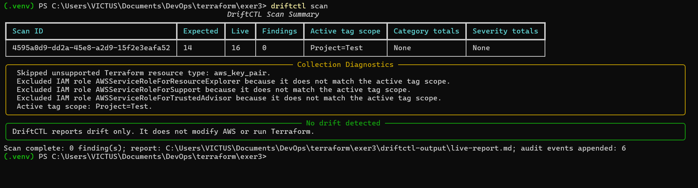

When your environment contains application-facing resources, a clean baseline can include NAT gateways, Application Load Balancers, target groups, listeners, listener rules, and RDS DB instances. The counts will vary by environment. What matters is that DriftCTL reports `0` findings after Terraform has applied the intended configuration.

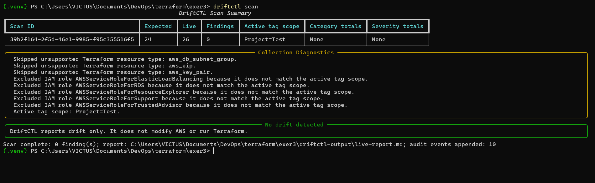

## 6. Optional: Non-Production Controlled Drift Validation

This optional section records the controlled non-production validation used for this project. It proves that DriftCTL can detect real differences between Terraform state and AWS. The exact resource names, IP addresses, tags, and temporary changes belong to this example environment; they are not required steps for every DriftCTL user.

In normal use, point DriftCTL at your own applied Terraform project and run one scan. It compares every supported resource inside the selected scope and reports all drift it finds in that run. These tests introduce one temporary change at a time only so that each type of detection can be shown and checked clearly.

DriftCTL stays read-only during every test. The temporary changes below are made manually in the AWS Console so that the tool has drift to find.

Use the same Terraform directory, AWS profile, region, and tag scope as the baseline scan. The example environment uses `Project=Test`; use a tag and values that match your own environment.

### Test 1: Find a Small Tag Change

This test checks that a tag-only change on a Terraform-managed VPC is reported as `modified` drift with `minor` severity.

In the AWS Console, open **VPC**, select a Terraform-managed test VPC that has `Project=Test`, and add this temporary tag:

```text
Owner=drift-validation
```

Do not remove the `Project=Test` tag. DriftCTL needs it to include the VPC in the scan. From the Terraform project folder, run:

```powershell
driftctl scan
```

The terminal should show a `Networking` finding with `modified` drift and `minor` severity. Remove the temporary `Owner=drift-validation` tag in the AWS Console, then run `driftctl scan` again and confirm the green `No drift detected` result before continuing.

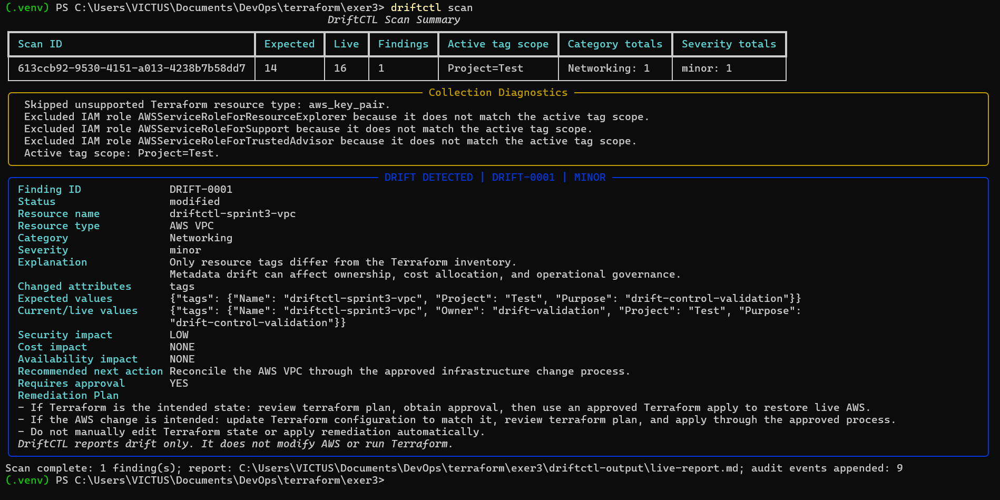

### Test 2: Find a Resource Terraform Does Not Manage

This test checks that DriftCTL finds a resource created in AWS that is not listed in Terraform state.

In the AWS Console, create an **unattached security group** in the same VPC as your test infrastructure. Give it a clear temporary name, add both `Project=Test` and an optional descriptive tag such as `Purpose=drift-control-validation`, and do not add inbound rules. An unattached security group with no inbound rules does not expose an instance and does not create EC2 running cost.

Run:

```powershell
driftctl scan
```

The terminal should show a `Networking` finding with `unmanaged` drift. Delete the temporary security group in the AWS Console, then run `driftctl scan` again and confirm a clean result before moving on.

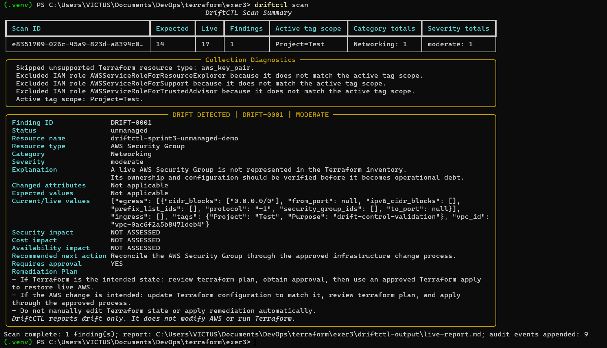

### Test 3: Find Unsafe Public SSH Access

This test checks that DriftCTL treats public SSH access as a `critical` risk. The test uses a detached security group, so it does not expose a running EC2 instance.

Before this test, create and apply a separate **Terraform-managed, unattached** security group with the scan tag and no inbound rules. It must already exist in Terraform state before you edit it manually. Do not use a security group attached to an EC2 instance. First run a baseline scan and make sure it returns `0` findings.

> [!WARNING]
> Use only an unattached security group in a non-production environment. Remove the temporary public SSH rule immediately after verifying the finding.

In the AWS Console, open the detached test security group's **Inbound rules**. Add a temporary rule with these values:

- Type: `SSH`
- Port: `22`
- Source: `Anywhere-IPv4` (`0.0.0.0/0`)

Save the rule and run the scan immediately:

```powershell
driftctl scan
```

The terminal should show a `Networking` finding with `modified` drift and `critical` severity. It should state that public SSH exposure caused the risk level. Remove the temporary SSH rule in the AWS Console immediately after checking the result, then confirm a clean scan.

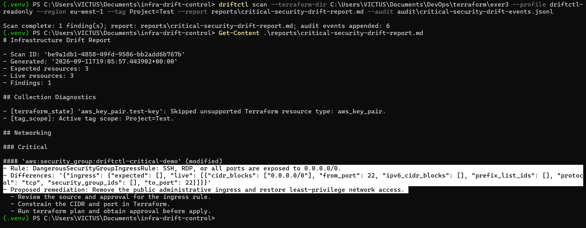

### Test 4: Find an Unsafe Private Route

This test checks that DriftCTL reports a route added manually to a private route table. Use a dedicated test VPC with no production workloads.

> [!WARNING]
> Changing routes can interrupt application traffic. Perform this test only in a dedicated non-production VPC, and delete the temporary route as soon as the scan has completed.

In the AWS Console, open the private route table created by Terraform. If it already has a default route through a NAT gateway, edit or replace that route temporarily instead of trying to add a second `0.0.0.0/0` route:

- Destination: `0.0.0.0/0`
- Target: the test VPC's internet gateway, rather than the NAT gateway

Run:

```powershell
driftctl scan
```

The terminal should show a `Networking` finding with `modified` drift and `severe` severity. Restore the original NAT-gateway default route immediately, then confirm a clean scan.

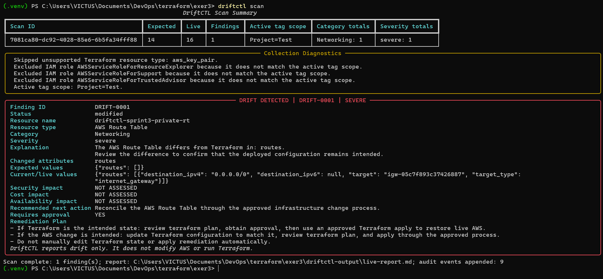

The application-infrastructure validation below shows the same kind of unsafe route replacement in an environment that uses a NAT gateway for private egress.

### Test 5: Find an IAM Policy Attachment Change

This test checks that DriftCTL detects a managed policy attached manually to a Terraform-managed IAM role.

In the AWS Console, open the dedicated test role created by Terraform. Attach the AWS-managed policy whose exact name is `ReadOnlyAccess` and whose ARN is `arn:aws:iam::aws:policy/ReadOnlyAccess`. Do not remove the policy Terraform attached to the role.

> [!WARNING]
> Attach the temporary policy only to a dedicated test role. Detach it immediately after the scan; do not use this validation step on a role that supports a production workload.

Run:

```powershell
driftctl scan
```

The terminal should show an `IAM` finding with `modified` drift and `moderate` severity. Detach only the temporary `ReadOnlyAccess` policy, then confirm a clean scan.

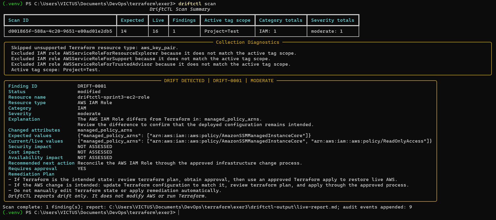

### Test 6: Find a Route 53 Record Change

This test checks that DriftCTL detects a record value changed outside Terraform.

In Route 53, open the private test hosted zone. Edit the Terraform-managed A record and replace its IP address with a different private test address. For example, change `10.30.2.10` to `10.30.2.11`.

Run:

```powershell
driftctl scan
```

The terminal should show a modified Route 53 record finding. Restore the original record value exactly, then confirm a clean scan.

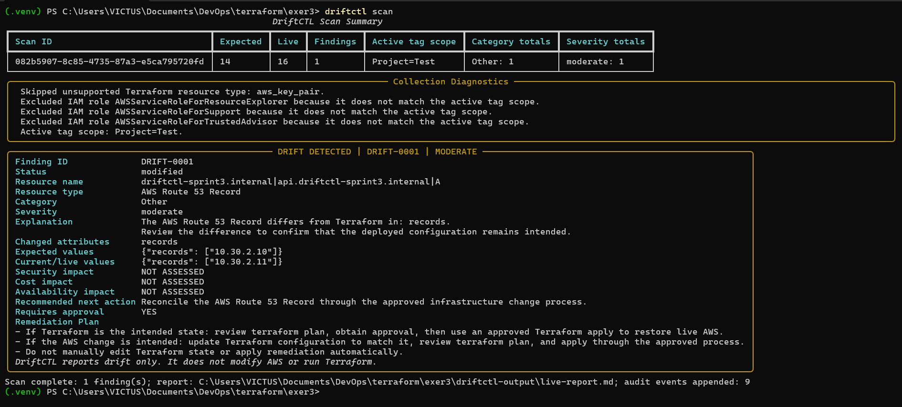

### Test 7: Confirm the Environment Is Clean Again

After removing every temporary change, run one final baseline scan:

```powershell
driftctl scan
```

A clean result shows `0` findings and the green `No drift detected` panel. You can keep a detached Terraform-managed test security group as a reusable test fixture if it stays unattached and has no inbound rules.

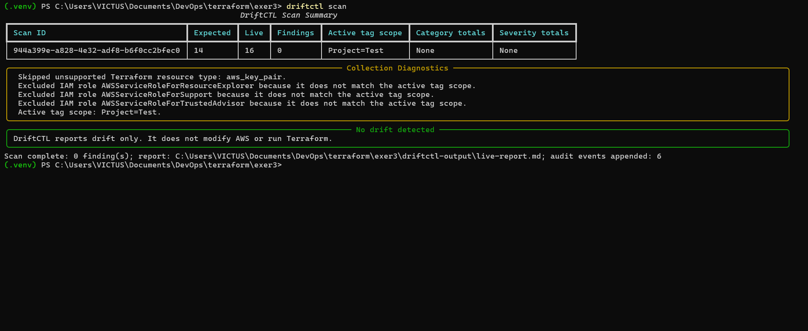

### Application-Facing Infrastructure Validation

This section documents additional controlled tests for NAT gateways, Application Load Balancers, and RDS DB instances. Use it only when your own Terraform test environment contains equivalent resources. These are examples of how the tool was validated, not changes every DriftCTL user should make.

> [!WARNING]
> Perform these tests only in a dedicated non-production environment. DriftCTL remains read-only, but the temporary changes are made through the AWS Console or with a separate administrative identity such as the identity used by Terraform. Do not use the `driftctl-readonly` profile to make changes, and do not perform these tests against production services.

### Test 8: Find a Target Group Health-Check Change

Choose a Terraform-managed Application Load Balancer target group whose health-check path is explicitly declared in Terraform. In the AWS Console, open **EC2**, then **Target Groups**, select the test target group, and edit its health-check path. For example, change `/health` to `/ready`.

Run the scan:

```powershell
driftctl scan
```

The terminal should show one `modified` `AWS Load Balancer Target Group` finding. A health-check configuration difference is normally reported as `moderate` because it can affect how the load balancer decides whether targets are ready to receive traffic. Restore the exact path recorded in Terraform, then run another scan and confirm a clean result.

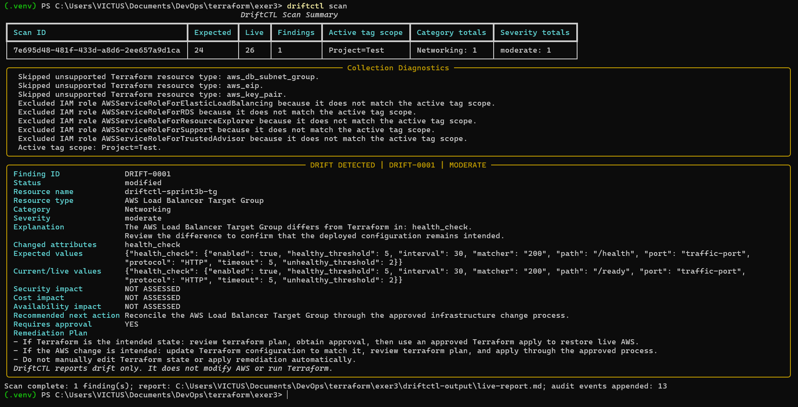

### Test 9: Find an RDS Deletion-Protection Change

Choose a Terraform-managed RDS DB instance that has deletion protection enabled in Terraform. In the AWS Console, open **RDS**, select the test DB instance, choose **Modify**, temporarily disable deletion protection, select **Apply immediately**, and wait until the instance returns to the `Available` state.

Run the scan:

```powershell
driftctl scan
```

The terminal should show one `modified` `AWS RDS DB Instance` finding. DriftCTL reports weaker deletion protection as `severe` because it makes accidental database removal easier. Re-enable deletion protection, wait until the modification finishes, and confirm a clean scan before continuing.

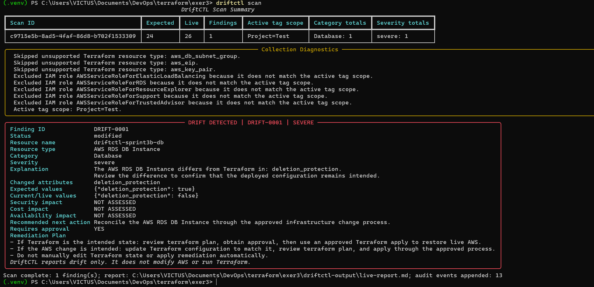

### Test 10: Reconfirm NAT Route Protection

If the test VPC has a private route table whose default route uses a NAT gateway, temporarily replace that default route's target with the VPC internet gateway. Run `driftctl scan` immediately. The terminal should show a `modified` route-table finding with `severe` severity because the private route now points directly to the internet gateway.

Restore the default route so that it targets the original NAT gateway. Then run a final scan:

```powershell
driftctl scan
```

The scan should show `0` findings and the green `No drift detected` panel. This final confirmation matters: it proves that the temporary controlled changes have been removed and that the Terraform expectation and AWS configuration match again.

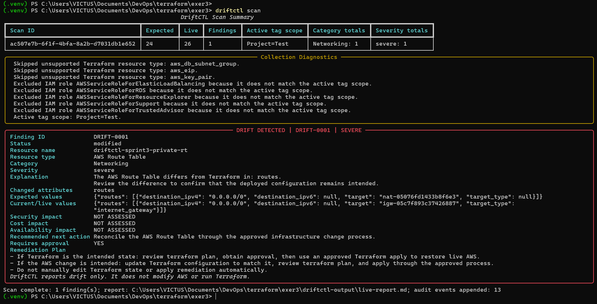

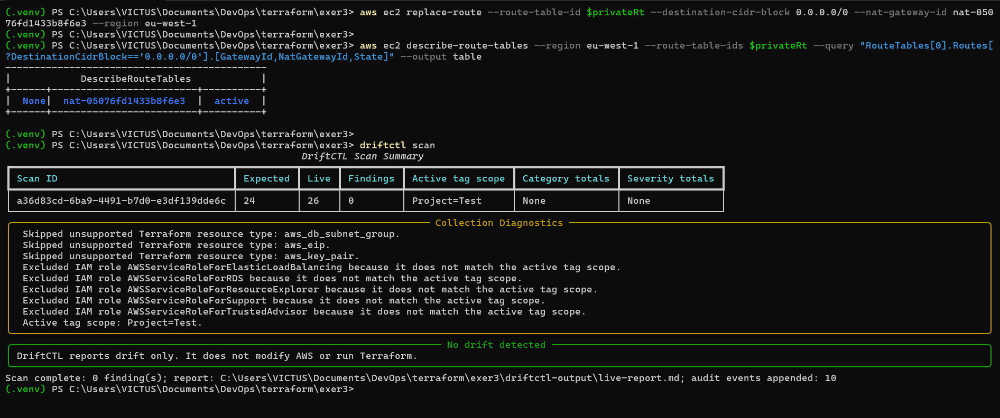

### ECS on Fargate Validation

This section records the controlled ECS validation used for this project. It demonstrates that DriftCTL can compare an ECS cluster, task definition, Fargate service, and CloudWatch log group against Terraform's applied state. It is not a production deployment pattern and is not a required step for normal DriftCTL use.

Use the opt-in ECS configuration in `infra/terraform/live-validation/` only in a dedicated non-production environment. It creates a small ECS cluster, task definition, Fargate service, CloudWatch log group, task roles, and a security group with no inbound rules. The service uses a public task IP to retrieve a public image without creating a NAT gateway. Production teams should choose their own network, image, identity, and scaling design.

> [!WARNING]
> Perform the following AWS changes only with a separate administrative identity, such as the identity used by Terraform. Do not use the `driftctl-readonly` profile. DriftCTL remains read-only; the temporary changes below are deliberately introduced so the scanner can detect them.

Before introducing any change, run `driftctl scan` and confirm a clean baseline with `0` findings.

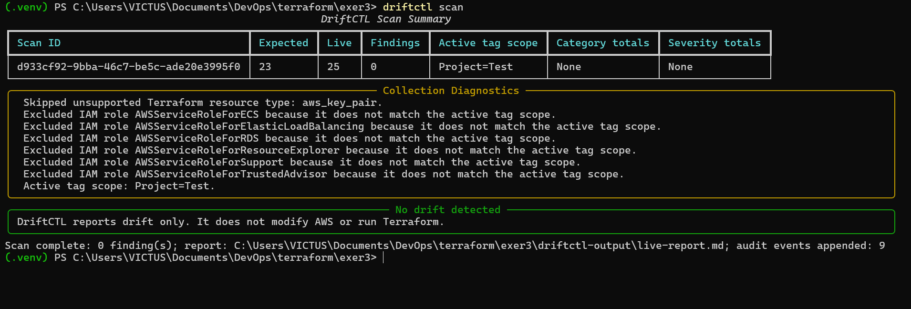

### Test 11: Find a CloudWatch Log Retention Change

With Terraform expecting seven days of retention, temporarily change the log group to one day:

```powershell
aws logs put-retention-policy --log-group-name "/driftctl/sprint3/ecs" --retention-in-days 1 --region eu-west-1
```

Run `driftctl scan`. The terminal should show one `modified` `AWS CloudWatch Log Group` finding for `retention_in_days`, normally with `moderate` severity. Restore the Terraform value before continuing:

```powershell
aws logs put-retention-policy --log-group-name "/driftctl/sprint3/ecs" --retention-in-days 7 --region eu-west-1
```

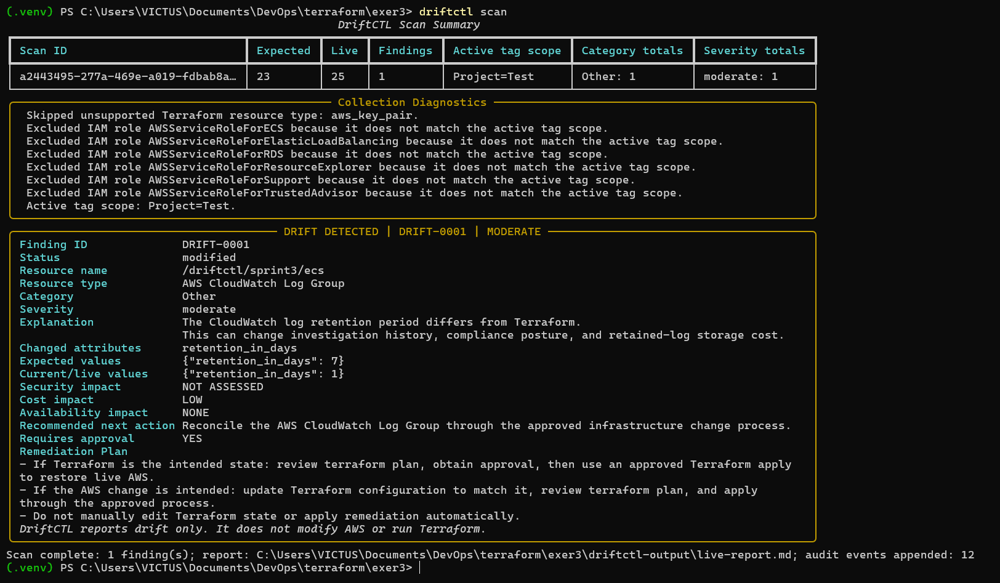

### Test 12: Find an ECS Desired-Count Change

Temporarily scale the Fargate service from one task to zero:

```powershell
aws ecs update-service --cluster driftctl-sprint3-ecs --service driftctl-sprint3-fargate --desired-count 0 --region eu-west-1
```

Run `driftctl scan`. DriftCTL should report one `modified` `AWS ECS Service` finding for `desired_count`. For this specific change it records `HIGH` availability impact because the service expects a running task but is scaled to zero; security remains `NOT ASSESSED` because the service's workload purpose is not known.

Restore the expected count, wait until the service reports `ACTIVE` with both desired and running counts at `1`, then scan again:

```powershell
aws ecs update-service --cluster driftctl-sprint3-ecs --service driftctl-sprint3-fargate --desired-count 1 --region eu-west-1
driftctl scan
```

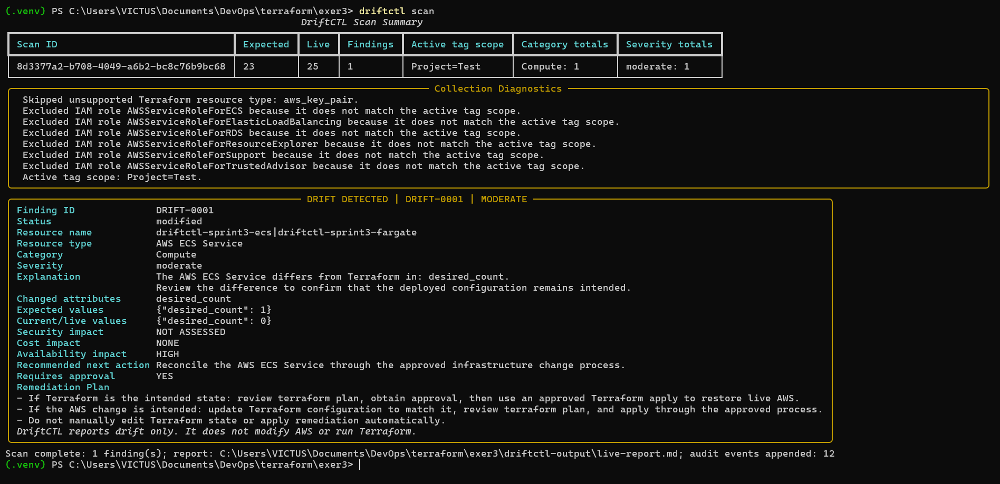

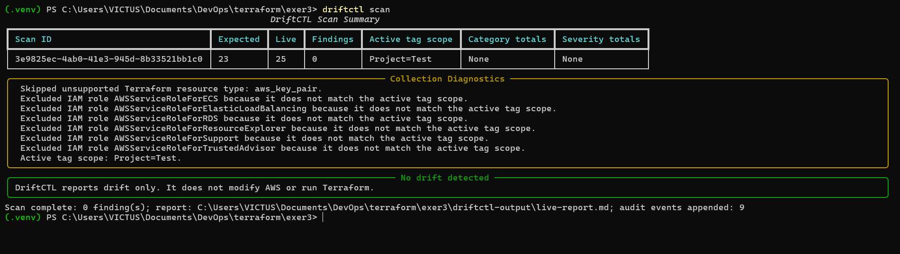

## Troubleshooting

| Issue | Solution |
| --- | --- |
| `driftctl` is not recognized | Activate the virtual environment with `.\.venv\Scripts\Activate.ps1`. Then run `python -m pip install -e ".[dev]"` from the DriftCTL repository. |
| AWS credentials cannot be found | Check that the AWS CLI profile exists with `aws sts get-caller-identity --profile driftctl-readonly`. Use the same profile name in the command or in `driftctl.toml`. |
| Terraform state cannot be read | Point DriftCTL at the Terraform working directory that owns the applied state. In that directory, run `terraform show -json` to make sure Terraform can read the state. Do not commit this output because it can contain details about your infrastructure. |
| `driftctl scan` says it needs a Terraform directory, region, report, or audit path | Make sure `driftctl.toml` is in the current Terraform project folder and includes all required `[scan]` values. You can also use the full command and provide the missing option directly. |
| A resource is missing from a scoped scan | Check that the resource has every tag listed in your `--tag` options or in the `tags` setting of `driftctl.toml`. Then run `terraform plan` and `terraform apply` if Terraform still needs to add the tag. |
| A NAT gateway, ALB, RDS, ECS, or CloudWatch Logs resource is not collected | Update the dedicated read-only policy from `infra/iam/driftctl-read-only-policy.json`, attach the new policy version to the scanning identity, then verify the profile can use the required read APIs. |
| The scan is clean but the expected and live counts differ | Read the collection diagnostics. AWS-managed resources, tag-scoped exclusions, and unsupported Terraform resource types can change counts without representing drift. |
